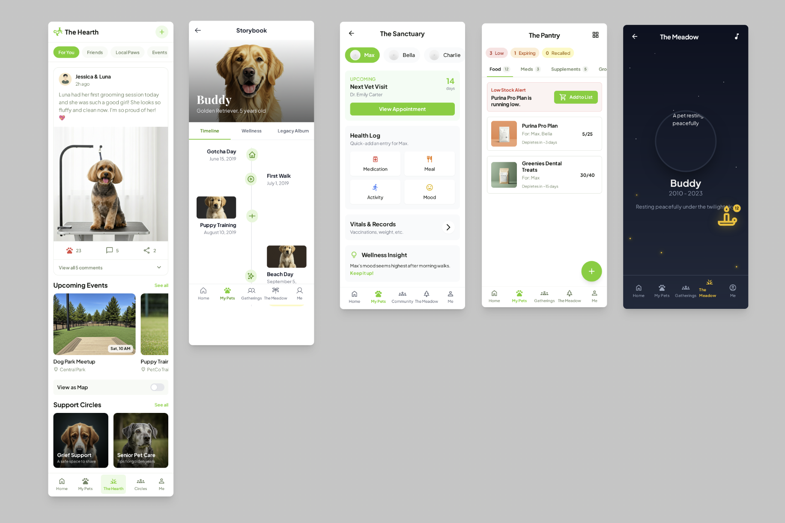

### Overall Design Language

* Color Palette:
   * Primary: Warm terracotta, soft sage green, creamy off-white, and a gentle charcoal for text. This feels earthy, natural, and comforting.
   * Accent: A warm, hopeful gold for highlights, badges, and important call-to-actions.
   * Memorial Garden: A distinct palette of deep twilight blues, soft purples, and glowing gold/silver to create a serene, magical atmosphere.
* Typography:
   * Headings: A soft, friendly serif font (like Lora or Playfair Display) to give a "storybook" feel.
   * Body Text: A clean, highly-readable sans-serif font (like Nunito Sans or Poppins) for clarity.
* Iconography: Custom, line-art icons with a hand-drawn feel (e.g., a paw with a heart, a leaf, a sparkling star).
* Imagery: The UI is designed to frame user-uploaded photos and videos beautifully, with soft drop shadows and borderless layouts that blend into the page.

---

Here's a breakdown of the app's pages, combining features for a seamless user journey.

### Page Designs

#### Navigation (The Constant Element)

* Mobile: A simple, 5-icon bottom navigation bar for the most critical sections.
   * `Home` (Community Feed) | `My Pets` (Profiles & Wellness) | `Gatherings` (Events & Circles) | `The Meadow` (Memorial Garden) | `Me` (User Profile)
* PC/Desktop: A fixed sidebar on the left with the same navigation items, expanded with text labels. The main content area is wider, allowing for multi-column layouts.

---

### Page 1: The Hearth (Community Feed, Events & Circles)

This page combines the core social feed with discovery and participation in events and support circles.

Purpose: To connect with the community, share updates, join gatherings, and find emotional support.

Key Elements (Mobile View):
1. Header: "The Hearth" title with a subtle leaf/paw logo. A "New Post" (+) button is prominently displayed.
2. Filter Pills: Below the header, users can tap to filter the feed: `For You` | `Friends` | `Local Paws` | `Events` | `Circles`.
3. Post Cards: Single column of cards (updates, media, achievements). Each card has:
   * User Name & Pet's Name ("Sarah & Luna").
   * User & Pet Profile Pics (small, circular, side-by-side).
   * Content (text, photo, or video) with immersive media layout.
   * Engagement icons: glowing paw (Love), speech bubble (Comment), share.
   * Comments collapsed by default.
4. Events Inline Module:
   * Horizontal scroll carousel appearing after the first few posts (or when `Events` filter active).
   * Compact event chips showing title, date badge, and location icon. Tap opens Event Detail.
   * Toggle to Map View (sheet overlay on mobile; split pane on desktop) showing nearby events.
   * Floating "Create Event" button when viewing the Events filter.
5. Support Circles Inline Module:
   * Grid or horizontal chips representing circles (e.g., "Grieving Hearts").
   * Each shows abstract animated gradient banner, name, short tagline, join/enter button.
   * Joining adds Circle-specific feed threads blended (tagged) into main feed when desired.
6. Circle Space (Inline Transition): Entering a Circle subtly tints the UI with that circle's gradient. Feed filters to circle posts plus pinned resources. A tab allows switching back to Global Feed without modal disruption.
7. Create Menu (Long Press / Plus): Options: Post Update, Share Milestone, Create Event, Start Circle Discussion.
8. Accessibility & Content Density Controls: User can toggle showing/hiding Events & Circles modules to tailor their feed.

Desktop View:
* Left Column: Main navigation.
* Center Column: Unified feed (posts, interleaved event teasers, circle highlights).
* Right Column:
   * Local Events panel (mini calendar + list).
   * Map thumbnail (expandable) when hovering events.
   * Suggested Circles with animated gradient previews.
   * Quick Actions (Create Event, Start Discussion, Invite Friend).
* Optional Split Mode: Selecting Map toggles a dual layout (feed left, interactive map right) with event pins; selecting a Circle opens a side panel thread view.

Integrated Interaction Patterns:
* Joining a Circle adds a soft badge to relevant posts (e.g., Circle icon at corner).
* RSVP to Event from card via a 1-tap state cycle: Interested -> Going -> Remove.
* Event reminders surface as subtle inline cards near top of feed on event day.
* Circle announcements appear as gently highlighted posts (no harsh banners).

Mesmerizing Touch:
* Loving a post emits soft golden glow.
* Event RSVP triggers a brief ring ripple (gold fading to transparent) around the date badge.
* Circle gradient banners very slowly shift hue (reduced motion honors system preference).

---

### Page 2: The Storybook (Pet Profile & Timeline)

This is the heart of the app, where a pet's life is celebrated. It combines the Profile, Timeline, and Legacy Album features.

Purpose: To create a rich, beautiful, and collaborative history of a pet's life.

Key Elements (Mobile View):
1. Hero Section: A large, beautiful cover photo of the pet. Overlaid is the pet's name in the elegant serif font, with their breed/type and age underneath.
2. Tab Navigation: Below the hero, three clear tabs: `Timeline` | `Legacy Album`.
3. Timeline (Default View):
   * This is not a simple list. It's a visual, vertical timeline. A central line runs down the page.
   * Events (photos, stories, milestones) branch off to the left and right, creating a dynamic, scrapbook-like feel.
   * Each entry has a date, a title, and a small icon (e.g., camera for photo, cake for birthday, star for achievement).
   * Achievement badges are woven directly into the timeline where they were earned.
4. Wellness Tab: A direct portal to the Care & Wellness Tracker for this specific pet.
5. Legacy Album Tab:
   * This looks like a digital scrapbook. Users see a grid of "pages."
   * Friends and family who have been invited can add their own pages with photos and notes.
   * A prominent "Export/Print" button allows users to generate a PDF or order a physical book.

Desktop View:
* The timeline has more horizontal space, allowing for richer content snippets to be visible without clicking.
* The Legacy Album can show a two-page spread, mimicking a real open book.

Mesmerizing Touch: As you scroll down the timeline, the central line subtly animates, and the event cards gently fade into view. This creates a feeling of gracefully journeying through the pet's life.

---

### Page 3: The Sanctuary (Care & Wellness Tracker)

While accessible from the pet's profile, this can also be a standalone section for a holistic view of all pets.

Purpose: To provide a clear, calm, and proactive way to manage a pet's health.

Key Elements (Mobile View):
1. Pet Selector: A dropdown or carousel at the top to switch between your pets.
2. Dashboard View: A clean grid of cards for key areas:
   * Upcoming: Shows the next vet visit or medication dose with a countdown.
   * Health Log: Quick-add buttons for `Medication`, `Meal`, `Activity`, `Mood`.
   * Vitals & Records: A place to view vaccination history, weight charts, etc.
   * Wellness Insight: A special card that surfaces connections, e.g., "Max's mood seems highest after morning walks. Keep it up!"

Desktop View:
* The dashboard is more expansive, showing charts and logs side-by-side. Users can drag and drop to customize their dashboard layout.

Mesmerizing Touch: The charts and graphs aren't sterile. They use the app's soft color palette and have subtle animations. For example, when you log a "happy" mood, a small, gentle sunburst animation appears before the data is saved.

---

### Page 4: The Meadow (Virtual Garden for Memorials)

This is the most sacred space in the app. The design shifts to be more ethereal and serene.

Purpose: To provide a beautiful, interactive, and permanent space to honor pets who have passed.

Key Elements (Mobile & Desktop are similar, just scaled):
1. The Environment: This is not a list or a grid. It's a full-screen, illustrated, interactive landscape of a peaceful meadow at twilight. The sky is a deep blue with soft, twinkling stars. Fireflies drift lazily across the screen.
2. Memorials: Instead of profiles, pets are represented by a unique, glowing object the user chooses: a specific flower, a smooth river stone, or a floating lantern.
3. Interaction:
   * Users can pan and zoom around the meadow to explore.
   * Tapping on a memorial object causes it to glow brighter, and a small pop-up appears with the pet's name and dates.
   * Tapping the pop-up opens the pet's Memorial Page—a simplified, read-only version of their "Storybook" timeline.
4. Leaving Tributes: On a Memorial Page, visitors can't "comment." Instead, they can "Light a Candle"—an action that places a small, softly glowing candle icon next to their name, which remains for a period of time.

Mesmerizing Touch: The entire page is the mesmerizing touch. There is optional, ambient, calming music. The subtle animations of the stars, fireflies, and gentle sway of the flowers create a living, breathing memorial that feels respectful and deeply moving. The transition into The Meadow is a slow cross-fade, preparing the user for the change in tone.

---

### Page 5: The Pantry (Inventory & Supplies Manager)

Purpose: To give owners a proactive, low-friction way to track consumables, medications, and recurring supply needs across multiple pets—preventing shortages, waste, and missed refills.

Key Elements (Mobile View):
1. Top Bar: Title "The Pantry" with a compact stock status summary (e.g., 3 Low | 1 Expiring | 0 Recalled) as tappable pills.
2. Category Tabs / Chips: `Food` | `Meds` | `Supplements` | `Grooming` | `Misc` with badge counts. Horizontal scrollable.
3. Item Cards (List/Grid toggle):
   * Thumbnail (photo or auto icon), name, assigned pets (stacked mini avatars).
   * Remaining Quantity + Unit (progress ring or bar with color: green >60%, amber 30–60%, red <30%).
   * ETA Depletion (e.g., "Runs out in 5 days") calculated from consumption logs.
   * Tap opens Item Detail Sheet.
4. Quick Add (+) Floating Button: Opens radial or sheet to scan barcode, manual add, or receipt OCR.
5. Low Stock Banner: Contextual, appears only when critical items < threshold—allows bulk "Add to Shopping List" action.
6. Item Detail Sheet:
   * Quantity tracker (increment/decrement + unit selector, supports partial units for meds).
   * Batch / Lot Number + Expiration date fields (auto highlight if < 14 days).
   * Recall Status (fetched asynchronously; shows green check or warning with link to advisory).
   * Assigned Pets + Per-Pet Daily Allocation summary.
   * Consumption Graph (sparkline last 30 days) with variance indicator.
   * Reorder Options: Preferred retailers (stars) + price compare (last known vs current).
7. Shopping List View: Collapsible drawer listing aggregated needed items with quantities; export share sheet (PDF / link).
8. Notifications Preferences Inline: Per item toggle for Low Stock, Expiration, Refill (meds) without leaving context.

Desktop View:
* Left Sidebar: Category list + filters (Low Stock, Expiring Soon, Recalled, Assigned to Pet X).
* Center Panel: Inventory table/grid with sortable columns (Name, Category, Remaining %, Depletion ETA, Expiration).
* Right Panel: Dynamic Detail Inspector showing selected item (mirrors mobile sheet) + Shopping List dock.
* Multi-Select: Checkboxes enable bulk actions (Adjust Quantity, Add to Shopping List, Mark Refilled).
* Drag & Drop: Reorder priority in Shopping List and rearrange category groupings.

Data & Intelligence Enhancements:
* Predictive Refill: Uses moving average consumption; flags anomalies ("Spike in kibble usage +35% this week").
* Smart Threshold Suggestion: After 3 usage cycles, suggests ideal reorder point (e.g., when 9 days remain based on lead time history).
* Cost Analytics: Monthly spend breakdown per category/pet with gently animated stacked bar.
* Recall Auto-Match: Periodic background check against a recall dataset; highlights impacted lots.

Mesmerizing Touch:
* Progress rings gently animate depletion when updated (easing shrink).
* Adding an item produces a brief soft stacking animation into a virtual shelf line at top.
* When stock hits zero, item card gently desaturates and a subtle dust poof animation (reduced-motion compliant) draws attention.
* Predictive insights surface with a soft glowing underline that fades after first view.

